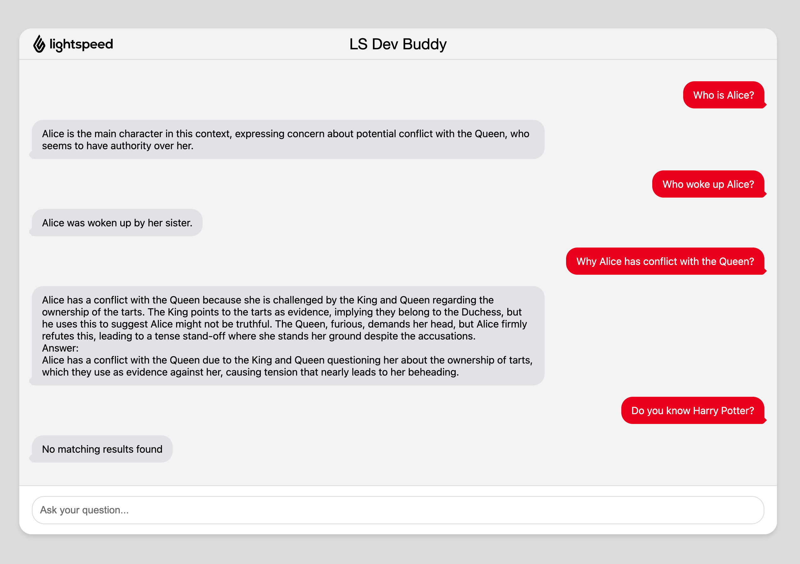

# LS Dev Buddy

We will create a fantasy chatbot that utilizes the local LLM to access all our internal resources, including JIRA tickets, Confluence pages, backstage documents, and video recordings. With an internal AI, there are no concerns about information leakage.

Are you tired of searching through JIRA or Confluence?  

Frustrated by waiting for answers from unavailable colleagues?  

Try LS Dev Buddy!

## tech stack

- `Python 3.11`
- `Pytorch`
- `Ollama`
- LLM: `Deepseek-r1:8b`
- Text embedding model: `sentence-transformers/all-MiniLM-L6-v2`

## Prepare the environment

This introduction is for macOS, and only work with Python 3.11

### For the first time running

1. Download and install Ollama on your mac: https://ollama.com/download/mac

2. Install `deepseek-r1:8b` model

    ```bash
    ollama run deepseek-r1:8b
    ```

3. Install python 3.11

    ```bash
    brew install python@3.11
    ```

4. Install the following dependencies:

    ```bash
    rm -rf myenv # Remove any previous virtual environment
    python3.11 -m venv myenv
    source myenv/bin/activate
    python --version  # Should say 3.11.x

    pip install --upgrade pip
    pip install torch torchvision torchaudio --index-url https://download.pytorch.org/whl/cpu
    pip install -r requirements.txt
    pip install "unstructured[md]"
    ```

### For every time running

Prepare the python environment

```bash
python3.11 -m venv myenv
source myenv/bin/activate
```

## Create database

Create the Chroma DB.

```python
python src/create_database.py
```

## Query the database (CLI)

Query the Chroma DB.

```python
python src/query_data.py "Who asked Alice to wake up?"
```

## Run the server

```python
python src/server.py
```

## Ask question by using API

```bash
$ curl -X POST http://localhost:3000/ask \
  -H "Content-Type: application/json" \
  -d '{"question": "Who has woke up Alice?"}'
```

The response should be:

```json
{
  "answer": "her sister"
}
```

## View from UI

Open the `web/index.html` file in your browser, or you can use IDE like VSCode and open it with Live Server.


